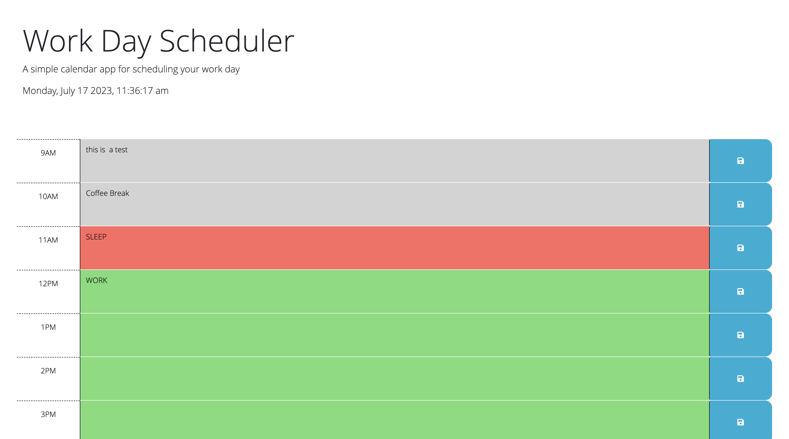

# workday-schedule
## Description

For the Workday Scheduler, the goal was to have a functioning live scheduler that update the color: gray for the past, red for the present, and green for the future based on the time. On the text box, we could input text and click the save button that will log the object into the local storage for later/when we refresh the page, it will still be there. It has the time and date on the top of the page to let us know what day it is if we didn't know.

- [Installation](#installation)
- [Usage](#usage)
- [Credits](#credits)
- [License](#license)

## Installation

I used the tools that I had on my computer, like Git, Vscode, Github, and Google. First, I cloned the repo into my local file, made a GitHub repo, and named both the local and global repo. I opened the file in my VScode and started coding the project, and used Chrome developer tools to live to check the website for errors and stuff. Then I push it into my GitHub for deployment.

## Usage

## Credits

resources:
https://www.youtube.com/playlist?list=PL0eyrZgxdwhy7byLHsVkuhtRV_IpoJU7n

## License

MIT License

## Deployed
https://simplyannzz.github.io/workday-schedule/

## contact me

email: anniebui0110@gmail.com
github: https://github.com/simplyannzz
